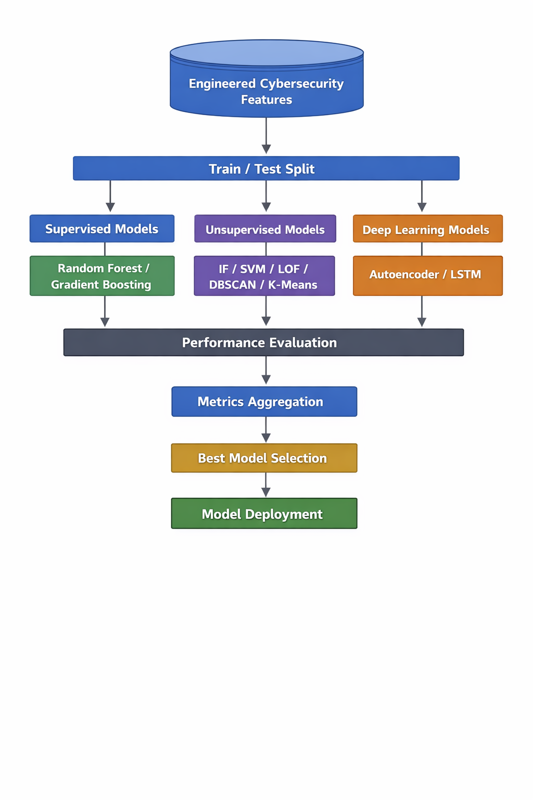
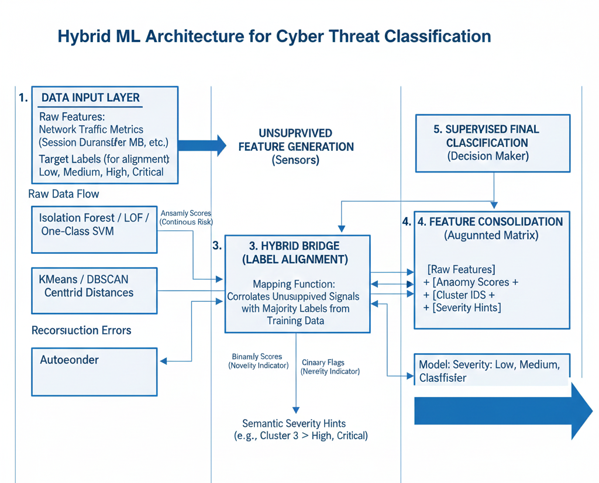
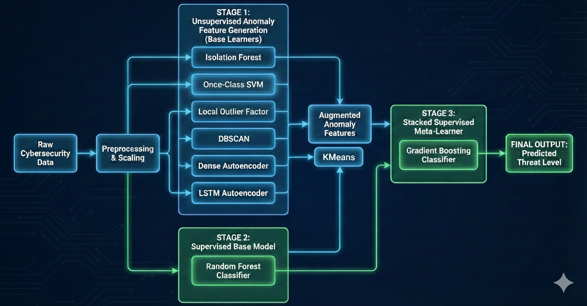
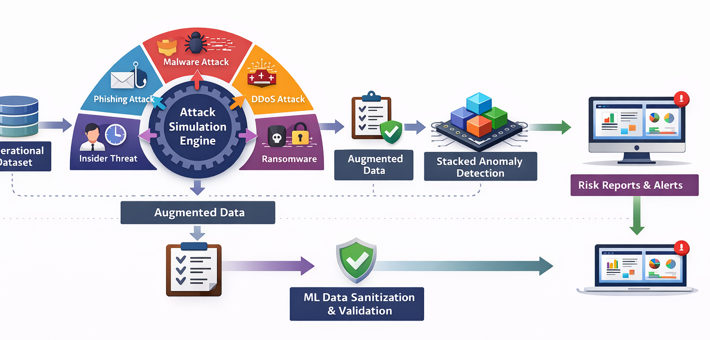
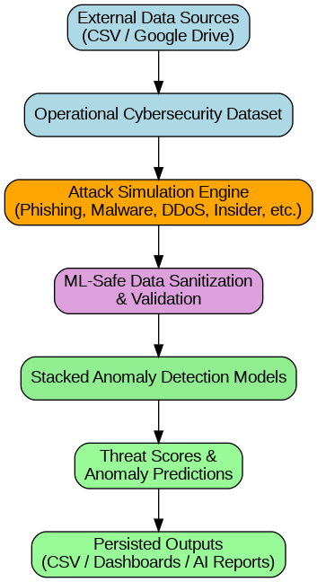

   
 <div align="center">
  
**Detecting Anomalous Behavior in Cyber security Analytics with Generative AI**
</div>

**Toronto, January 06, 2026**  
**Author : Atsu Vovor**    


  

<a 
  href="https://atsuvovor.github.io/CyberThreat_Insight/cyber_security_analytics.html" 
  target="_blank">
  
</a>

## **Abstract**

The **Cyber Threat Analytics & Insight** project applies advanced data analytics and machine learning techniques to detect and analyze anomalous behavior in user activity and network systems. Leveraging fully synthetic datasets generated through controlled data augmentation and generative modeling, the project explores patterns associated with cybersecurity risks and attack behaviors. This approach enables the simulation of realistic threat scenarios while supporting proactive detection, classification, and response strategies.

This initiative is research-driven and educational in nature, focusing on the application of generative algorithms and anomaly detection models within cybersecurity analytics. All data used in the project is intentionally synthetic, designed to emulate real-world cyberattack conditions without relying on externally sourced or sensitive datasets. The resulting framework demonstrates how organizations can extract actionable intelligence from behavioral data to enhance threat awareness, risk mitigation, and decision-making capabilities.


## **Introduction**

As cyber threats continue to grow in complexity and sophistication, the ability to identify subtle and abnormal behavioral patterns has become critical to effective cybersecurity operations. Traditional rule-based monitoring approaches often struggle to detect emerging threats that deviate only slightly from normal activity. The **Cyber Threat Analytics & Insight** project addresses this challenge by leveraging machine learning techniques to uncover anomalous behaviors within simulated cybersecurity environments.

By analyzing synthetic data that closely mirrors real-world user and system activity, the project identifies indicators such as excessive login attempts, abnormal session durations, and unusually large data transfers. These signals are analyzed to distinguish benign fluctuations from potentially malicious behavior. The insights generated by this framework support proactive threat detection, enabling security teams to respond more rapidly to both internal and external risks while improving overall cyber resilience.


## **Project Description**

The **Cyber Threat Analytics & Insight** project is designed as a comprehensive research and simulation framework for anomaly detection in cybersecurity analytics. It focuses on the following core components:

1. **Research and Analytical Objectives**
   The project investigates how machine learning and generative modeling techniques can enhance the detection and interpretation of complex cybersecurity threats. By identifying behavioral patterns that signal potential risk, the framework supports informed decision-making and risk mitigation strategies within security operations.

2. **Synthetic Data Generation and Augmentation**
   A fully synthetic cybersecurity dataset is created using data augmentation techniques such as SMOTE, Generative Adversarial Networks (GANs), label perturbation, time-series variability, and controlled noise injection. The resulting data exhibits realistic month-over-month volatility and includes embedded anomalies representing potential security incidents, such as elevated login attempts, extended session durations, and abnormal data transfer volumes.

3. **Machine Learning–Based Anomaly Detection**
   Multiple anomaly detection and classification techniques—including Isolation Forests, Autoencoders, and density-based clustering—are applied to identify deviations from established behavioral baselines. These models enable the detection and categorization of suspicious activity across users and systems.

4. **Proactive Threat Detection and Response Enablement**
   The framework integrates anomaly detection outputs with alerting logic to generate actionable insights for security teams. By identifying suspicious behavioral patterns early, the system supports timely investigation and response to emerging threats.

5. **Continuous Model Refinement**
   Detection outcomes and analyst feedback are incorporated into iterative model improvements, allowing the system to adapt to evolving threat patterns while reducing false positives over time.

6. **Cyber Attack Insight Simulation**
   The project includes a dedicated simulation component—**CyberAttack-Insight**—which demonstrates how synthetic, MITRE ATT&CK–aligned attack scenarios can be used to train and evaluate cybersecurity analytics. A stacked ensemble of machine learning models is employed to detect simulated threats such as DDoS attacks, malware activity, and data exfiltration, with a strong emphasis on model explainability and governance-aligned reporting.

7. **Project Outcomes and Impact**
   The final outcome is a modular anomaly detection framework capable of analyzing user behavior and system interactions to flag potentially malicious activity. By leveraging synthetic data and explainable machine learning models, **Cyber Threat Analytics & Insight** illustrates how organizations can strengthen cybersecurity resilience, improve threat visibility, and support future-focused threat prevention strategies.    


## **Scope of the Project**  
#### **1.Data Preparation( Data synthetization & Preprocessing)**  
🔄 👉Run the Model
<a 
  href="https://github.com/atsuvovor/CyberThreat_Insight/tree/main/datagen" 
  target="_blank">
  
</a>

This phase focuses on constructing a realistic, fully synthetic cybersecurity dataset that captures normal operational behavior, controlled anomalies, and temporal volatility. The process begins with the generation of a baseline *normal issues* dataset, which serves as the foundation for all subsequent anomaly modeling.

Using this baseline, a dedicated anomaly generation module `generate_anomalous_issues_df()` derives anomalous records directly from the normal dataset by selectively perturbing key attributes (e.g., login attempts, session duration, data transfer volume, and severity indicators). This approach ensures schema consistency, improves maintainability, and enables flexible control over anomaly density and feature composition when anomalous samples are scarce.

To enhance realism and temporal dynamics, synthetic data generation incorporates controlled techniques such as label permutation, time-series variability, and noise injection to introduce month-over-month volatility and behavioral deviations. These methods simulate real-world cybersecurity conditions, including bursts of abnormal activity and gradual shifts in risk profiles.

While advanced augmentation techniques such as **SMOTE** and **Generative Adversarial Networks (GANs)** are referenced at this stage for conceptual completeness, they are applied primarily during the **feature engineering phase** to address class imbalance and enrich minority threat representations. This clear separation ensures that data preparation establishes a coherent behavioral baseline, while feature engineering focuses on model-ready balancing and representational enhancement.


 **Core Data Schema**:
   Each column is structured to simulate real-world attributes.  

  
   - `Issue ID`, `Issue Key`: Unique identifiers.
   - `Issue Name`, `Category`, `Severity`: Descriptive issue metadata with categorical values.
   - `Status`, `Reporters`, `Assignees`: Status categories and personnel involved.
   - `Date Reported`, `Date Resolved`: Randomized dates across a timeline.
   - `Impact Score`, `Risk Level`: Randomized scores to reflect varying severity.
   - `Cost`: Randomized to reflect the volatility in month-over-month impact.  

**User Activity Columns**:
   Columns like `user_id`, `timestamp`, `activity_type`, `location`, `session_duration`, and `data_transfer_MB` will be generated to simulate behavioral patterns.

**Monthly Volatility**:  
  - **Impact Score**, **Cost**, and **data_transfer_MB** We use synthetic techniques to create spikes or drops in activity between months, simulating the volatility in issues or user activity.
  - For example, we use random walks to vary values in a non-linear fashion to capture realistic volatility.

**Data Augmentation**:
   - **Scaling Up Data Points**: We will use SMOTE or random sampling for categorical columns to add diversity.
   - **Label Swapping for `Assignees`, `Departments`**: Here, we randomly reassign categories periodically to simulate changing roles.
   - **Time-Series Variability**: We use simulated timestamps within and across sessions to show login attempts, data transfer spikes, and session durations.

**User activity features:**  

  - user_id: Identifier for each user.  
  - timestamp: Time of the activity.  
  - activity_type: Type of activity (e.g., "login," "file_access," "data_modification").  
  - location: User's location (e.g., IP region).  
  - session_duration: Length of session in seconds.  
  - num_files_accessed: Number of files accessed in a session.  
  - ogin_attempts: Number of login attempts in a session.  
  - data_transfer_MB: Amount of data transferred (MB).  

**Anomalies:**  

  - We include some rows with anomalous patterns like high login attempts, unusual session duration and high data transfer volumes from unexpected locations

**Explanation of Key Parts:**
- **Volatile Data Generation**: The `generate_volatile_data` function adds random fluctuations to values, simulating high month-over-month volatility.
- **User Activity Features**: Columns like `activity_type`, `session_duration`, `num_files_accessed`, `login_attempts`, and `data_transfer_MB` are varied to reflect real user behaviors.
- **Random Timestamps**: Activity timestamps are spread across the timeline from `start_date` to `end_date`.

- **Generate normal issues dataset**: First, we a normal issue dataset with almost no data anomaly
- **Generate anomalous issues dataset**: The we introduce anomaly to the detaset
- **Combine normal and anomalous data**: We combine both normal and anomalous datasets  
- **Adressing class imbalance in datasets**:Using SMOTE (Synthetic Minority Over-sampling Technique) we make sure that class imbalance in the dataset is resolved.  
all the data files are saves on google drive  

**User Activities Generation Metrics Formula**  

The expression:  base_value + base_value * volatility * (np.random.randn()) * (1.2 if severity in ['High', 'Critical'] else 1)

means that we’re generating a value based on a starting point (base_value) and adjusting it for both randomness and severity level. Here's a breakdown:

- **base_value**: This is the initial value that the output is based on.
- **volatility * (np.random.randn())**: This part adds a random fluctuation around the base_value. `np.random.randn()` generates a value from a standard normal distribution (centered around 0), so it could be positive or negative, creating variation. Multiplying by volatility scales the randomness, making the fluctuation stronger or weaker.
- **(1.2 if severity in ['High', 'Critical'] else 1)**: This adds an additional factor to increase the outcome by 20% if the severity is "High" or "Critical." If severity isn’t in these categories, the factor is simply 1, meaning no extra adjustment.

So, if severity is "High" or "Critical," the result is a base value adjusted for both volatility and severity; otherwise, it’s just the base value with volatility adjustment.  


**Treat level Identification and Adaptive Defense Systems Setting**

We will set up a threat level based our cybersecurity dataset generated. We will create a threat scoring model that combines multiple relevant features.  

**Key Threat Indicators (KTIs) Definition**  

The following columns will be uses as key threat indicators (KTIs):  

   - **Severity**: Indicates the criticality of the issue.
   - **Impact Score**: Represents the potential damage if the threat is realized.
   - **Risk Level**: A general indicator of risk associated with each issue.
   - **Issue Response Time Days**: The longer it takes to respond, the higher the threat level could be.
   - **Category**: Certain categories (e.g., unauthorized access) carry a higher base threat level.
   - **Activity Type**: Suspicious activity types (e.g., high login attempts, data modification) indicate a greater threat.
   - **Login Attempts**: Unusually high login attempts signal a brute force attack.
   - **Num Files Accessed** and **Data Transfer MB**: Large data transfers or access to many files in a session could indicate data exfiltration or suspicious activity.

**KTIs based Scoring**
  
For each KTI we will define the acriteria to be used to assigne a score  

| KTI               | Condition                                      | Score   |
|-------------------|------------------------------------------------|---------|
| Severity          | Critical = 10, High = 8, Medium = 5, Low = 2   | 2 - 10  |
| Impact Score      | 1 to 10 (already a score)                      | 1 - 10  |
| Risk Level        | High = 8, Medium = 5, Low = 2                  | 2 - 8   |
| Response Time     | >7 days = 5, 3-7 days = 3, <3 days = 1         | 1 - 5   |
| Category          | Unauthorized Access = 8, Phishing = 6, etc.    | 1 - 8   |
| Activity Type     | High-risk types (e.g., login, data_transfer)   | 1 - 5   |
| Login Attempts    | >5 = 5, 3-5 = 3, <3 = 1                        | 1 - 5   |
| Num Files Accessed| >10 = 5, 5-10 = 3, <5 = 1                      | 1 - 5   |
| Data Transfer MB  | >100 MB = 5, 50-100 MB = 3, <50 MB = 1         | 1 - 5   |  


**Threat Score Calculation**
The threat level is calculated as a weighted sum of these scores. For example:

*Threat Score = 0.3 × Severity + 0.2 × Impact Score + 0.2 × Risk Level + 0.1 × Response Time + 0.1 × Login Attempts + 0.05 × Num Files Accessed + 0.05 × Data Transfer MB*

Note: The weights could be adjusted based on the importance of each factor in your specific cybersecurity context.

**Threat Level Thresholds Definition**  

We use the final threat score to categorize the threat level:
   - **Low Threat**: 0–3
   - **Medium Threat**: 4–6
   - **High Threat**: 7–9
   - **Critical Threat**: 10+

**Real-Time Calculation and Monitoring Implementation**
To implement this dynamically we :
   - Calculate and log the threat score whenever new data is added.
   - Set up alerts for high and critical threat scores.
   - Integrate this scoring model into a real-time dashboard or cybersecurity scorecard.

This method provides a structured and quantifiable approach to assessing the threat level based on multiple relevant indicators from the initial dataset.  

**Rule-based Adaptive Defense Mechanism**  

Here we will add logic that monitors specific threat conditions in real-time and adapt responses based on defined rules. This will include automatic flagging of high-threat issues, increasing logging frequency for suspicious activities, and assigning specific mitigation actions based on the threat level and activity context.

**Rules Definition**  
 We will use the following features to define rules that will be applied to identify potential threats and recommend defensive actions: `Threat Level`, `Severity`, `Impact Score`, `Login Attempts`, `Risk Level`, `Issue Response Time Days`, `Num Files Accessed`,`Data Transfer MB`.   

**Defense Mechanism**: The system will respond adaptively by adding flags and assigning custom actions based on the rule evaluations and scenarios colors

   
 The defense mechanism assigns an adaptive `Defense Action` to each issue based on threat conditions, adding an extra layer of automated response for varying threat levels and behaviors.
 The treat conditions are implemented by Color-coding cybersecurity scenarios, we bealieve, is a helpful way to quickly communicate risk levels and prioritize response actions. Here's a suggested approach to buld the scenarios, where we use **intensity of red, orange, yellow, and green** to represent risk:

**Color Scheme**
- **Critical Threat & Severity**: **Dark Red** – Highest urgency.
- **High Threat or Severity**: **Orange** – Serious, but not the highest urgency.
- **Medium Threat or Severity**: **Yellow** – Moderate concern.
- **Low Threat & Severity**: **Green** – Low concern, monitor as needed.

Here is the table **with colored emoji icons added** beside each color name in **Suggested Color**.
These icons render correctly in GitHub, Markdown, Slack, Teams, Notion, and Streamlit.


#### **Scenarios with Colors**


| **Scenario** | **Threat Level** | **Severity** | **Suggested Color**  | **Rationale**                                                                         |
| ------------ | ---------------- | ------------ | -------------------- | ------------------------------------------------------------------------------------- |
| **1**        | Critical         | Critical     | 🔴 **Dark Red**      | Maximum urgency, both threat and impact are critical. Immediate action required.      |
| **2**        | Critical         | High         | 🟥 **Red**           | Very high risk, threat is critical and impact is significant. Prioritize response.    |
| **3**        | Critical         | Medium       | 🟧 **Orange-Red**    | Significant threat but moderate impact. Act promptly to prevent escalation.           |
| **4**        | Critical         | Low          | 🟧 **Orange**        | High potential risk, current impact is minimal. Monitor closely and mitigate quickly. |
| **5**        | High             | Critical     | 🟥 **Red**           | High threat combined with critical impact. Needs immediate action.                    |
| **6**        | High             | High         | 🟧 **Orange-Red**    | High threat and significant impact. Prioritize response.                              |
| **7**        | High             | Medium       | 🟧 **Orange**        | Elevated threat and moderate impact. Requires attention.                              |
| **8**        | High             | Low          | 🟨 **Yellow-Orange** | High threat with low impact. Proactive monitoring recommended.                        |
| **9**        | Medium           | Critical     | 🟧 **Orange**        | Moderate threat with critical impact. Prioritize addressing the severity.             |
| **10**       | Medium           | High         | 🟨 **Yellow-Orange** | Medium threat with high impact. Needs resolution soon.                                |
| **11**       | Medium           | Medium       | 🟨 **Yellow**        | Medium threat and impact. Plan to address it.                                         |
| **12**       | Medium           | Low          | 🟨 **Light Yellow**  | Moderate threat, minimal impact. Monitor as needed.                                   |
| **13**       | Low              | Critical     | 🟨 **Yellow**        | Low threat but high impact. Address severity first.                                   |
| **14**       | Low              | High         | 🟨 **Light Yellow**  | Low threat with significant impact. Plan mitigation.                                  |
| **15**       | Low              | Medium       | 💛 **Green-Yellow**  | Low threat, moderate impact. Routine monitoring.                                      |
| **16**       | Low              | Low          | 🟩 **Green**         | Minimal risk. No immediate action required.                                           |


This color based scenarios approach aligns urgency with the dual factors of **threat level** and **severity**, ensuring quick comprehension and appropriate prioritization.  


#### **2.Explanatory Data Analysis(EDA)**  
🔄 👉Run the Model
<a 
  href="https://github.com/atsuvovor/CyberThreat_Insight/tree/main/explanatory_data_analysis" 
  target="_blank">
  
</a>

The following steps were implemented in the exploratory data analysis (EDA) pipeline to analyze the dataset's key features and distribution patterns:

**Data Normalization:**
   - Implemented a function to normalize numerical features using Min-Max Scaling for consistent feature scaling.

**Time-Series Visualization:**
   - Plotted daily distribution of numerical features pre- and post-normalization using line plots for visualizing trends over time.

**Statistical Feature Analysis:**
   - Developed histograms and boxplots for all features, including overlays of statistical metrics (mean, standard deviation, skewness, kurtosis) for numerical features.
   - Integrated risk levels with customized color palettes for categorical data.

**Scatter Plot and Correlation Analysis:**
   - Created scatter plots to analyze relationships between key features such as session duration, login attempts, data transfer, and user location.
   - Generated a correlation heatmap to visualize interdependencies among numerical features.

**Distribution Analysis Pipeline:**
   - Built a modular pipeline to evaluate and compare the distribution of activity features across daily and aggregated reporting frequencies (e.g., monthly, quarterly).

**Comprehensive Feature Analysis:**
   - Combined scatter plots, heatmaps, and distribution visualizations into a unified framework for insights into user behavior and feature relationships.

**Dynamic Layouts and Annotations:**
   - Optimized subplot layouts to handle a variable number of features and annotated plots with key statistics for enhanced interpretability.

This pipeline provides a detailed understanding of numerical and categorical feature behaviors while highlighting correlations and potential anomalies in the dataset.

<p align="center">
  
</p>

<p align="center">
  
</p

<p align="center">
  
</p

<p align="center">
  
</p
  
### 3.**Features Engineering Pipeline**
🔄 👉Run the Model
<a 
  href="https://github.com/atsuvovor/CyberThreat_Insight/tree/main/feature_engineering" 
  target="_blank">
  
</a>

The feature engineering pipeline was designed to simulate realistic cybersecurity scenarios, enhance anomaly detection, and prepare the dataset for effective model training. It involved the following key steps:

* **Synthetic Data Load**: Real-time behavioral data was simulated to represent normal system activity.
* **Anomaly Injection (Cholesky Perturbation)**: Statistically realistic anomalies were introduced to compensate for the natural scarcity of threat events.
* **Feature Normalization**: All features were scaled using Min-Max and Z-score methods to ensure consistent input ranges.
* **Correlation Analysis**: Pearson and Spearman heatmaps helped identify and mitigate multicollinearity among variables.
* **Feature Importance (Random Forest)**: The most influential threat indicators were identified for model optimization.
* **Model Explainability (SHAP)**: SHAP values provided interpretability for each prediction, essential for SOC analysts.
* **Dimensionality Reduction (PCA)**: Principal Component Analysis reduced noise while preserving important behavioral patterns.
* **Data Augmentation (SMOTE + GANs)**: Oversampling techniques balanced the dataset by generating synthetic threat instances.
  
<div align="center">
<p align="center">
  
</p>


<p align="center">
  
</p>

<p align="center">
  
</p>  


<p align="center">
  
</p>

<p align="center">
  
</p>

<p align="center">
  
</p>

</div  
This workflow produced a clean, balanced, and interpretable feature set optimized for machine learning–based cyber threat classification.


### 4.**Model Developemnt - Cyber Threat Detection Engine**  
🔄 👉Run the Model
<a 
  href="https://github.com/atsuvovor/CyberThreat_Insight/tree/main/model_dev" 
  target="_blank">
  
</a>


The **Cyber Threat Detection Engine** is a three-stage framework designed to identify security threats by evolving from simple baselines to a complex, stacked ensemble model.

#### The Three-Stage Evolution

* **Stage 1 (Baseline):** Established performance benchmarks using standard supervised and unsupervised algorithms like Random Forest and Isolation Forest.
<div align="center">
 <h3 align="center">High-Level Pipeline</h3> 
  
</div>  

* **Stage 2 (Feature Engineering):** Converted unsupervised anomaly scores into new input features to help the model better recognize rare, high-severity attacks.  
  <div align="center">
    
</div>

* **Stage 3 (Stacking):** Created a two-layer hybrid ensemble combining **Random Forest** (base) and **Gradient Boosting** (meta-learner) for final classification.  
<div align="center">
 <h3 align="center"> Stacked Supervised Model using Unsupervised Anomaly Features </h3> 
  
</div>


#### Key Outcomes

* **Better Detection:** The stacked model achieved **88% accuracy**, specifically improving the detection of "Critical" (Class 3) threats compared to single-model approaches.
* **Smart Augmentation:** Used **Generative AI (GANs)** and SMOTE to fix data imbalances and simulate realistic attack patterns.
* **Deployment Ready:** The system is designed to integrate with SIEM platforms using serialized artifacts for real-time analytics.

### 5.**CyberAttack-Insight Simulation**  
🔄 👉Run the Model
<a 
  href="https://github.com/atsuvovor/CyberThreat_Insight/tree/main/cyber_attack_insight" 
  target="_blank">
  
</a>


<div align="center">
<h3>CyberAttack-Insight - Attack Simulation & Stacked Anomaly Detection Platform</h3>
 

 <h3>Platform Capabilities at a Glance & High-Level Architecture</h3>


</div>   
  
  
**CyberAttack-Insight** is a simulation-based cybersecurity analytics platform designed as a professional portfolio and educational demonstration. It showcases how **synthetic cyber-attack scenarios** and **stacked anomaly detection models** can be architected within a governance- and audit-aware framework. The platform simulates multiple MITRE ATT&CK–aligned attack types, applies a stacked ensemble of unsupervised and supervised machine learning models to generate anomaly scores and threat levels, and produces dashboard-ready outputs and executive reports. All data and attacks are intentionally synthetic and non-operational, emphasizing explainability, model risk management, and regulatory alignment rather than real-world deployment.  

The simulated attack types includes:  

* **Denial of Service (DoS) / Distributed DoS (DDoS)** – traffic flooding to disrupt service availability  
* **Brute Force Attacks** – repeated credential attempts to gain unauthorized access  
* **Port Scanning / Reconnaissance** – probing systems to discover open ports and services  
* **Malware-related Attacks** – malicious activity indicative of trojans, worms, or infected hosts  
* **Privilege Escalation / Unauthorized Access Attempts** – abnormal access behavior beyond normal user roles  
* **Data Exfiltration / Suspicious Data Transfer** – unusually large or abnormal outbound data flows  

These attack types are simulated and detected through anomaly detection and classification models to support cybersecurity monitoring and executive reporting.


## Project Structure

```ruby
CyberThreat_Insight/
├── .github/
│   ├── FUNDING.yml
│   ├── SPONSORS.md
│   ├── CODEOWNERS
│   ├── ISSUE_TEMPLATE/
│   ├── PULL_REQUEST_TEMPLATE.md
│   └── workflows/                # CI/CD (Docker, tests)
├── ai_agent/
│   ├── __init__.py
│   ├── validation_agent.py
│   ├── exec_insight_agent.py
│   ├── soc_support_agent.py
│   └── orchestrator.py           # AI orchestration logic
├── airflow/
│   └── dags/
│       └── pipeline_dag.py        # Airflow DAG orchestration
├── config/
│   └── pipeline.yaml              # Pipeline paths + retry config
├── cyber_attack_insight/
├── cybersecurity_data/
├── datagen/
├── explanatory_data_analysis/
├── feature_engineering/
├── insights/
├── llms_models/
├── model_deployment/
├── model_dev/
├── model_inference/
├── production/
├── prompts/
├── stacked_models_deployment/
├── utils/
│   ├── logger.py                  # Centralized logging & timing
│   └── retry.py                   # Retry logic
├── .dockerignore
├── .gitignore
├── Dockerfile                     # Docker build file
├── Makefile                      # Pipeline helpers
├── app.py                        # Streamlit dashboard
├── main.py                       # Pipeline entry point
├── requirements.txt
├── setup.py
├── README.md
├── CONTRIBUTING.md 
└── docs/                         # architectural docs

```

## **Project Files**
Here’s a summary of important files in the repository:

- **[`.gitignore`](./.gitignore)** - This file lists all the files and directories to be ignored by Git.
- **[`requirements.txt`](./requirements.txt)** - Contains the dependencies required to run the project.
- **[`setup.py`](./setup.py)** - Setup script for packaging and distributing the project.
- **.py files** - Contains the main Python source code files for the project.
  - **[`main.py`](main.py)** - Entry point for the project.
- **multiple notebooks and HTML/MD docs** - the **.ipynb files** Contain Jupyter Notebooks for data analysis and modeling.
 

## 📂 Repository Structure (Contributor Guide)

- `model_dev/` — Model development and experimentation
- `model_inference/` — Inference and evaluation pipelines
- `production/` — Production and simulation workflows
- `cyber_attack_insight/` — Dash / Plotly dashboards and attack simulations
- `.github/` — Community, funding, and contribution guidelines


## **Installation**
To install the project, follow these steps:

1. Clone the repository:
   ```bash
   #git clone https://github.com/atsuvovor/CyberThreat_Insight.git
   !git clone https://github.com/atsuvovor/CyberThreat_Insight.git 2>/dev/null
   !pip install -r /content/CyberThreat_Insight/requirements.txt -q
   #  then   
   cd my-python-project


## ▶️ How to Use (Local / CI / Demo)

### Run full pipeline

```bash
python main.py
```

### Run a single stage

```bash
python main.py --stage inference
python main.py --stage dashboard
```


## **Example: Google Colab Environnement**

```bash
#pipeline
!git clone https://github.com/atsuvovor/CyberThreat_Insight.git 2>/dev/null
!pip install -r /content/CyberThreat_Insight/requirements.txt -q

#dev
%run /content/CyberThreat_Insight/model_dev/stacked_model/stacked_anomaly_detection_classifier.py

#inference
%run /content/CyberThreat_Insight/model_inference/model_inference.py

#production simulation"
%run /content/CyberThreat_Insight/production/stacked_ad_classifier_prod.py

#attack
%run /content/CyberThreat_Insight/cyber_attack_insight/attack_simulation_v02.py

#Vidualization(Dashboard)
%run /content/CyberThreat_Insight/cyber_attack_insight/attacks_executive_dashboard_v02.py

```

---


## **Next Step Improvement**  
* Add logging + timing metrics  
* Introduce YAML config for paths  
* Add error recovery / retry logic  
* Convert this to Makefile / Airflow DAG  
* AI Agent Orchestration: Validation Agent, Executive Insight delivery Agent, SOC Sopport AI Agent  
* Containerization (Docker → Docker Hub)  
* Streamlit Dashboard as a backend  
---
## 🤝 Connect with me
I am always open to collaboration and discussion about new projects or technical roles.

Atsu Vovor  
Consultant, Data & Analytics    
Ph: 416-795-8246 | ✉️ atsu.vovor@bell.net    
🔗 <a href="https://www.linkedin.com/in/atsu-vovor-mmai-9188326/" target="_blank">LinkedIn</a> | <a href="https://atsuvovor.github.io/projects_portfolio.github.io/" target="_blank">GitHub</a> | <a href="https://public.tableau.com/app/profile/atsu.vovor8645/vizzes" target="_blank">Tableau Portfolio</a>    
📍 Mississauga ON      

### Thank you for visiting!🙏

